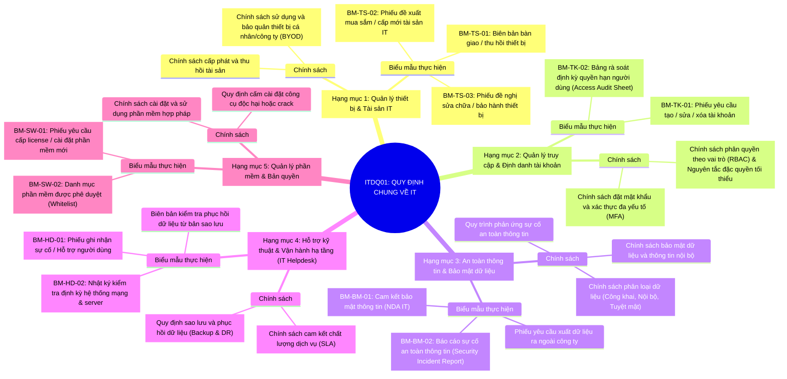

```mermaid
mindmap
  root((ITDQ01: QUY ĐỊNH CHUNG VỀ IT))
    ["Hạng mục 1: Quản lý thiết bị & Tài sản IT"]
      Chính sách
        Chính sách cấp phát và thu hồi tài sản
        ["Chính sách sử dụng và bảo quản thiết bị cá nhân/công ty (BYOD)"]
      Biểu mẫu thực hiện
        ["BM-TS-01: Biên bản bàn giao / thu hồi thiết bị"]
        ["BM-TS-02: Phiếu đề xuất mua sắm / cấp mới tài sản IT"]
        ["BM-TS-03: Phiếu đề nghị sửa chữa / bảo hành thiết bị"]

    ["Hạng mục 2: Quản lý truy cập & Định danh tài khoản"]
      Chính sách
        ["Chính sách đặt mật khẩu và xác thực đa yếu tố (MFA)"]
        ["Chính sách phân quyền theo vai trò (RBAC) & Nguyên tắc đặc quyền tối thiểu"]
      Biểu mẫu thực hiện
        ["BM-TK-01: Phiếu yêu cầu tạo / sửa / xóa tài khoản"]
        ["BM-TK-02: Bảng rà soát định kỳ quyền hạn người dùng (Access Audit Sheet)"]

    ["Hạng mục 3: An toàn thông tin & Bảo mật dữ liệu"]
      Chính sách
        Chính sách bảo mật dữ liệu và thông tin nội bộ
        ["Chính sách phân loại dữ liệu (Công khai, Nội bộ, Tuyệt mật)"]
        Quy trình phản ứng sự cố an toàn thông tin
      Biểu mẫu thực hiện
        ["BM-BM-01: Cam kết bảo mật thông tin (NDA IT)"]
        ["BM-BM-02: Báo cáo sự cố an toàn thông tin (Security Incident Report)"]
        Phiếu yêu cầu xuất dữ liệu ra ngoài công ty

    ["Hạng mục 4: Hỗ trợ kỹ thuật & Vận hành hạ tầng (IT Helpdesk)"]
      Chính sách
        ["Chính sách cam kết chất lượng dịch vụ (SLA)"]
        ["Quy định sao lưu và phục hồi dữ liệu (Backup & DR)"]
      Biểu mẫu thực hiện
        ["BM-HD-01: Phiếu ghi nhận sự cố / Hỗ trợ người dùng"]
        ["BM-HD-02: Nhật ký kiểm tra định kỳ hệ thống mạng & server"]
        Biên bản kiểm tra phục hồi dữ liệu từ bản sao lưu

    ["Hạng mục 5: Quản lý phần mềm & Bản quyền"]
      Chính sách
        Chính sách cài đặt và sử dụng phần mềm hợp pháp
        Quy định cấm cài đặt công cụ độc hại hoặc crack
      Biểu mẫu thực hiện
        ["BM-SW-01: Phiếu yêu cầu cấp license / cài đặt phần mềm mới"]
        ["BM-SW-02: Danh mục phần mềm được phê duyệt (Whitelist)"]
```
