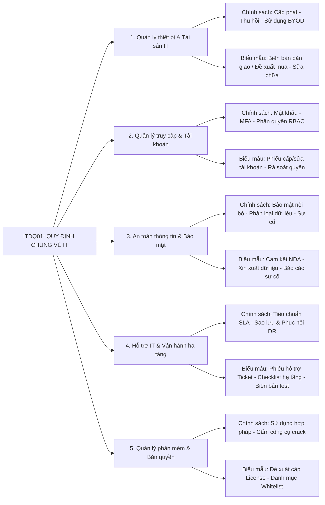

```mermaid
graph LR
    Root["ITDQ01: QUY ĐỊNH CHUNG VỀ IT"]

    %% Nhánh 1
    Root --> C1["1. Quản lý thiết bị & Tài sản IT"]
    C1 --> P1["Chính sách: Cấp phát - Thu hồi - Sử dụng BYOD"]
    C1 --> F1["Biểu mẫu: Biên bản bàn giao / Đề xuất mua - Sửa chữa"]

    %% Nhánh 2
    Root --> C2["2. Quản lý truy cập & Tài khoản"]
    C2 --> P2["Chính sách: Mật khẩu - MFA - Phân quyền RBAC"]
    C2 --> F2["Biểu mẫu: Phiếu cấp/sửa tài khoản - Rà soát quyền"]

    %% Nhánh 3
    Root --> C3["3. An toàn thông tin & Bảo mật"]
    C3 --> P3["Chính sách: Bảo mật nội bộ - Phân loại dữ liệu - Sự cố"]
    C3 --> F3["Biểu mẫu: Cam kết NDA - Xin xuất dữ liệu - Báo cáo sự cố"]

    %% Nhánh 4
    Root --> C4["4. Hỗ trợ IT & Vận hành hạ tầng"]
    C4 --> P4["Chính sách: Tiêu chuẩn SLA - Sao lưu & Phục hồi DR"]
    C4 --> F4["Biểu mẫu: Phiếu hỗ trợ Ticket - Checklist hạ tầng - Biên bản test"]

    %% Nhánh 5
    Root --> C5["5. Quản lý phần mềm & Bản quyền"]
    C5 --> P5["Chính sách: Sử dụng hợp pháp - Cấm công cụ crack"]
    C5 --> F5["Biểu mẫu: Đề xuất cấp License - Danh mục Whitelist"]
```
