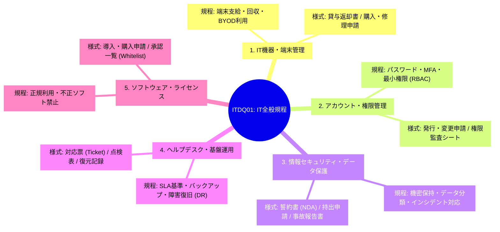

```mermaid
mindmap
  root((ITDQ01: IT全般規程))
    ["1. IT機器・端末管理"]
      ["規程: 端末支給・回収・BYOD利用"]
      ["様式: 貸与返却書 / 購入・修理申請"]
    ["2. アカウント・権限管理"]
      ["規程: パスワード・MFA・最小権限 (RBAC)"]
      ["様式: 発行・変更申請 / 権限監査シート"]
    ["3. 情報セキュリティ・データ保護"]
      ["規程: 機密保持・データ分類・インシデント対応"]
      ["様式: 誓約書 (NDA) / 持出申請 / 事故報告書"]
    ["4. ヘルプデスク・基盤運用"]
      ["規程: SLA基準・バックアップ・障害復旧 (DR)"]
      ["様式: 対応票 (Ticket) / 点検表 / 復元記録"]
    ["5. ソフトウェア・ライセンス"]
      ["規程: 正規利用・不正ソフト禁止"]
      ["様式: 導入・購入申請 / 承認一覧 (Whitelist)"]
```
