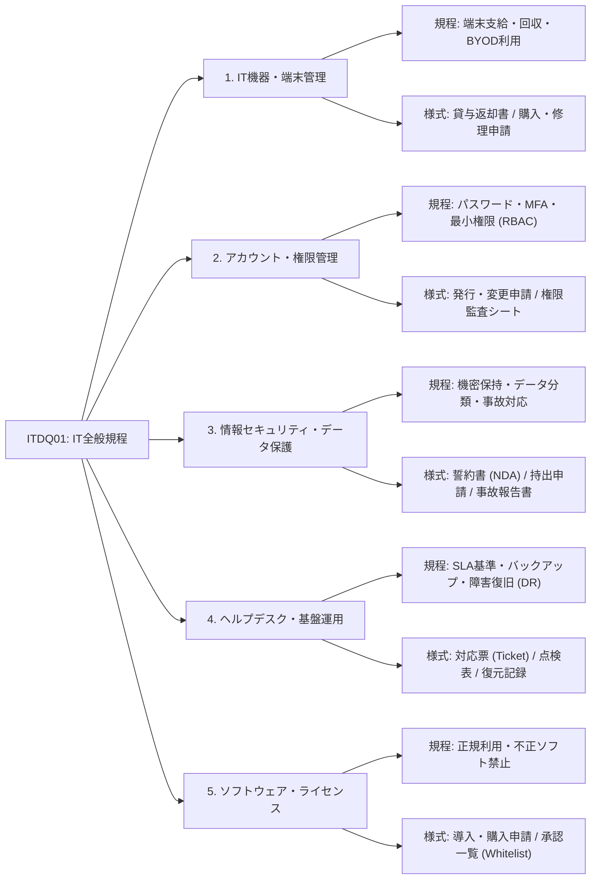

```mermaid
graph LR
    Root["ITDQ01: IT全般規程"]

    %% Nhánh 1
    Root --> C1["1. IT機器・端末管理"]
    C1 --> P1["規程: 端末支給・回収・BYOD利用"]
    C1 --> F1["様式: 貸与返却書 / 購入・修理申請"]

    %% Nhánh 2
    Root --> C2["2. アカウント・権限管理"]
    C2 --> P2["規程: パスワード・MFA・最小権限 (RBAC)"]
    C2 --> F2["様式: 発行・変更申請 / 権限監査シート"]

    %% Nhánh 3
    Root --> C3["3. 情報セキュリティ・データ保護"]
    C3 --> P3["規程: 機密保持・データ分類・事故対応"]
    C3 --> F3["様式: 誓約書 (NDA) / 持出申請 / 事故報告書"]

    %% Nhánh 4
    Root --> C4["4. ヘルプデスク・基盤運用"]
    C4 --> P4["規程: SLA基準・バックアップ・障害復旧 (DR)"]
    C4 --> F4["様式: 対応票 (Ticket) / 点検表 / 復元記録"]

    %% Nhánh 5
    Root --> C5["5. ソフトウェア・ライセンス"]
    C5 --> P5["規程: 正規利用・不正ソフト禁止"]
    C5 --> F5["様式: 導入・購入申請 / 承認一覧 (Whitelist)"]
```
