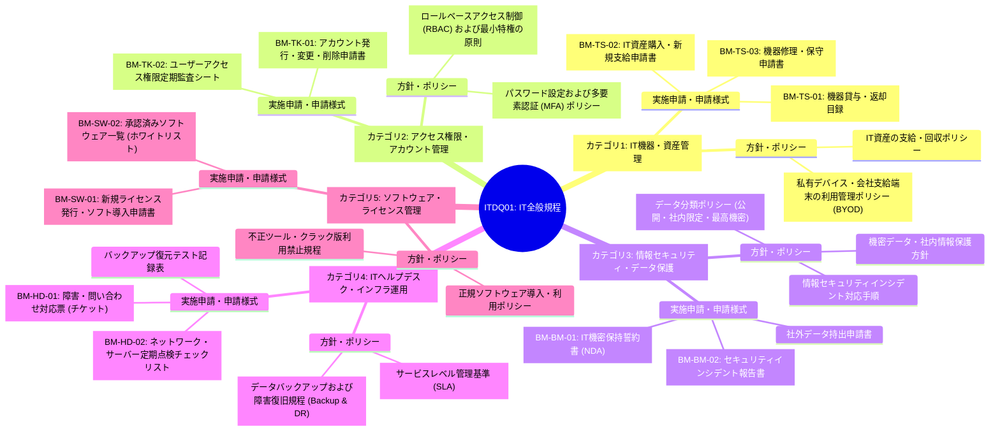

```mermaid
mindmap
  root((ITDQ01: IT全般規程))
    ["カテゴリ1: IT機器・資産管理"]
      方針・ポリシー
        IT資産の支給・回収ポリシー
        ["私有デバイス・会社支給端末の利用管理ポリシー (BYOD)"]
      実施申請・申請様式
        ["BM-TS-01: 機器貸与・返却目録"]
        ["BM-TS-02: IT資産購入・新規支給申請書"]
        ["BM-TS-03: 機器修理・保守申請書"]

    ["カテゴリ2: アクセス権限・アカウント管理"]
      方針・ポリシー
        ["パスワード設定および多要素認証 (MFA) ポリシー"]
        ["ロールベースアクセス制御 (RBAC) および最小特権の原則"]
      実施申請・申請様式
        ["BM-TK-01: アカウント発行・変更・削除申請書"]
        ["BM-TK-02: ユーザーアクセス権限定期監査シート"]

    ["カテゴリ3: 情報セキュリティ・データ保護"]
      方針・ポリシー
        機密データ・社内情報保護方針
        ["データ分類ポリシー (公開・社内限定・最高機密)"]
        情報セキュリティインシデント対応手順
      実施申請・申請様式
        ["BM-BM-01: IT機密保持誓約書 (NDA)"]
        ["BM-BM-02: セキュリティインシデント報告書"]
        社外データ持出申請書

    ["カテゴリ4: ITヘルプデスク・インフラ運用"]
      方針・ポリシー
        ["サービスレベル管理基準 (SLA)"]
        ["データバックアップおよび障害復旧規程 (Backup & DR)"]
      実施申請・申請様式
        ["BM-HD-01: 障害・問い合わせ対応票 (チケット)"]
        ["BM-HD-02: ネットワーク・サーバー定期点検チェックリスト"]
        バックアップ復元テスト記録表

    ["カテゴリ5: ソフトウェア・ライセンス管理"]
      方針・ポリシー
        正規ソフトウェア導入・利用ポリシー
        不正ツール・クラック版利用禁止規程
      実施申請・申請様式
        ["BM-SW-01: 新規ライセンス発行・ソフト導入申請書"]
        ["BM-SW-02: 承認済みソフトウェア一覧 (ホワイトリスト)"]
```
